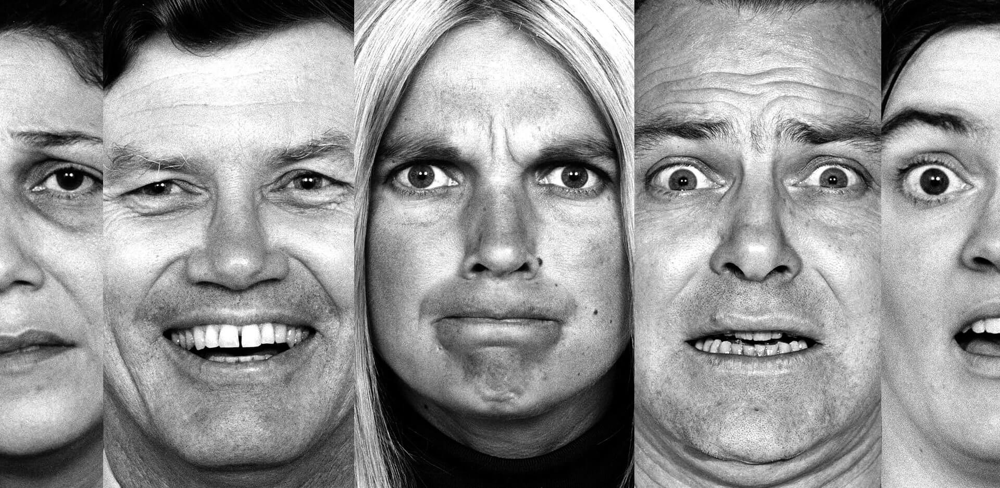

# Facial Emotion Recognition Project

## Handling Class Imbalance

In my analysis, I encountered a significant class imbalance within my dataset. To effectively address this issue, I implemented several strategies aimed at improving model performance and ensuring a more balanced representation of the classes. 
It is important to note that the dataset quality was not ideal, which likely contributed to unusually high validation accuracy scores (up to 100%) in some cases. This suggests potential issues with overfitting, despite efforts to mitigate class imbalance.

| **Model**      | **Strategy for Addressing Class Imbalance** | **Accuracy** | **Validation Score** | **Epochs** |
|----------------|---------------------------------------------|--------------|----------------------|------------|
| VGG 16        | Under Sampling                               | 68%          | 71%                  | 40         |
| VGG 16        | Focal Loss                                   | 80%          | 81%                  | 40         |
| Resnet_50      | Class Weights                                | 31%          | 100%                 | 40         |
| VGG 16        | Over Sampling                                | 62%          | 100%                 | 40         |

### Strategy Explanations

- **Under Sampling**: This technique reduces the number of instances in the majority class to balance the dataset. While it can help mitigate class imbalance, it may lead to underfitting, as potentially valuable information from the majority class is discarded.

- **Focal Loss**: Focal loss is an adjustment to the standard loss function that focuses more on difficult-to-classify examples, thereby improving performance on the minority class. This strategy helps to reduce the bias toward the majority class during training.

- **Class Weights**: This approach assigns higher weights to instances of the minority class during training, effectively penalizing the model more for misclassifying these instances. While it can improve the performance on the minority class, it can also lead to overfitting if the weights are not carefully managed.

- **Over Sampling**: Over sampling increases the number of instances in the minority class, often by duplicating existing instances. This can help the model learn better representations of the minority class but may also lead to overfitting if the duplicated samples are not varied enough.

## Project Overview
This project focuses on **predicting human emotions** from facial expressions using various **machine learning** and **deep learning** techniques. The goal is to classify different human emotions based on facial images. This project leverages a combination of:

- Traditional machine learning algorithms
- Advanced deep learning architectures
- Convolutional Neural Networks (CNN)
- Transfer Learning

By utilizing these techniques, the project aims to achieve high accuracy in emotion classification.

## Problem Statement
Human emotions are often conveyed through facial expressions. Automatically recognizing these emotions has numerous applications, such as in:

- Human-computer interaction
- Healthcare
- Surveillance
- Customer feedback analysis

The objective of this project is to predict emotions like **happiness**, **sadness**, **anger**, **fear**, and **surprise** from facial images.

## Dataset
The dataset used in this project contains labeled images of faces, each categorized into one of several emotion classes. Pre-processing steps were applied to ensure high-quality inputs, including:

- **Resizing** images to a consistent dimension
- **Normalization** to scale pixel values
- **Data augmentation** to improve model robustness by generating variations of the training data (e.g., flipping, rotation, and zooming)

**[Link to dataset](https://www.kaggle.com/datasets/msambare/fer2013)**  

## Methodologies
### 1. Machine Learning Algorithms
Several traditional machine learning algorithms were used as baselines for comparison with deep learning models. The feature extraction was performed using techniques such as **Principal Component Analysis (PCA)** and **Histogram of Oriented Gradients (HOG)** before feeding them into the following classifiers:

- **Support Vector Machines (SVM)**
- **Random Forest**
- **Artificial Neural Networks (ANN)**

### 2. Deep Learning Techniques
#### Convolutional Neural Networks (CNN)
CNNs were designed and trained from scratch to capture spatial hierarchies in the images. The architecture included:

- **Convolutional layers** for feature extraction
- **Max-pooling layers** to reduce spatial dimensions
- **Dropout layers** to prevent overfitting
- **Fully connected layers** for final classification

CNNs showed significant improvements in emotion recognition by learning complex features from facial images.

#### Transfer Learning
Pre-trained models such as **VGG** and **ResNet50** were used to take advantage of learned features from large image datasets. Fine-tuning these models on the facial emotion dataset resulted in improved performance and reduced training time, particularly for smaller datasets.

## Model Training and Evaluation
- **Data Augmentation**: Techniques like horizontal flipping, zooming, and rotation were applied to increase the size of the training set and improve generalization.
- **Loss Functions**: Models were trained using **categorical cross-entropy loss**, which is suitable for multi-class classification problems.
- **Optimization**: The models were optimized using the **Adam** optimizer with learning rate scheduling and early stopping to prevent overfitting.
- **Performance Metrics**: Accuracy, precision, recall, and F1-score were used to evaluate model performance. Confusion matrices were also utilized to visualize the results.

## Results
The deep learning models, especially CNNs and Transfer Learning models, significantly outperformed traditional machine learning algorithms in terms of both **accuracy** and **generalization**. Among the deep learning models, Transfer Learning with fine-tuning achieved the best results, demonstrating the power of leveraging pre-trained models.

- **Best CNN Model Accuracy**: ~90%
- **Best Transfer Learning Model Accuracy (ResNet50)**: ~93%
- **VGG Model Results**:
  - **Validation Accuracy**: 90%
  - **Training Accuracy**: 78%

## Technologies Used
- **Languages**: Python
- **Libraries**:
  - Machine Learning: `scikit-learn`
  - Deep Learning: `TensorFlow`, `Keras`
  - Image Processing: `OpenCV`
  - Data Handling: `NumPy`, `Pandas`
  - Visualization: `Matplotlib`, `Seaborn`
- **Tools**: Jupyter Notebook

## Conclusion
The project successfully implemented various machine learning and deep learning techniques to classify human emotions based on facial expressions. Transfer Learning, with its fine-tuning capabilities, provided the best results, showing that pre-trained models can be highly effective in small, specialized datasets. The VGG model also performed well with a validation accuracy of 90%.

